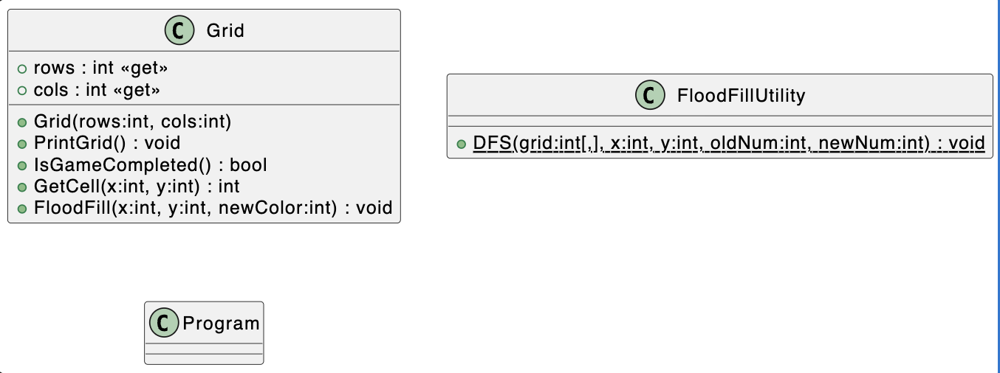

# Project Report

Course: C# Development SS2025 (4 ECTS, 3 SWS)

Student ID: 231008

BCC Group: Group B

Name: Alikhan Manat

## Methodology: 
### Flood Fill Algorithm
The Flood Fill Algorithm is a technique used to fill connected regions in a grid. It works by starting from a given cell and recursively (or iteratively) visiting its neighboring cells to determine whether they belong to the same region. If a neighboring cell has the same value as the starting cell, it is part of the region and gets replaced with the new value. This process continues for all connected cells in the region until the entire area is filled. There are two ways to design the Flood Fill Algorithm, which is using [DFS (Depth-First Search)](https://en.wikipedia.org/wiki/Depth-first_search#:~:text=Depth%2Dfirst%20search%20(DFS),along%20each%20branch%20before%20backtracking.) or [BFS (Breadth-First Search).](https://en.wikipedia.org/wiki/Breadth-first_search) <br>
The code below applies DFS which implements a recursion to check if neighboring values match the criteria:
```csharp
public static void DFS (int[,] grid, int x, int y, int oldNum, int newNum) 
    {
        int rows = grid.GetLength(0);
        int cols = grid.GetLength(1);

        // Check if the current position is out of bounds or if the color is not the same as the number in the left upper corner.
        if (x < 0 || x >= rows || y < 0 || y >= cols || grid[x, y] != oldNum)
            return;

        // Replace a number in a current cell with a new one.
        grid[x, y] = newNum;

        // Recursively call DFS for all four neighbors (up, down, left, right)
        // Check if a neighbor is the same number. If so, then replace it with a new number.
        DFS(grid, x + 1, y, oldNum, newNum); // Down
        DFS(grid, x - 1, y, oldNum, newNum); // Up
        DFS(grid, x, y + 1, oldNum, newNum); // Right
        DFS(grid, x, y - 1, oldNum, newNum); // Left
    }
```
### Grid
All the properties and methods of a grid are encapsulated within a single class. Keeping everything in one dedicated class file (`Grid.cs`) enhances readability and maintains a clean, organized structure.

## Class Diagram


## Discussion/Conclusion
There were no particular challenges except for deciding between DFS and BFS.

## Reference: 
* [DFS and BFS in daily life](https://www.youtube.com/watch?v=cPTgB3UeECk) 
* [G-6. Depth-First Search (DFS) | C++ and Java | Traversal Technique in Graphs](https://www.youtube.com/watch?v=Qzf1a--rhp8) 
* [Depth-first search](https://en.wikipedia.org/wiki/Depth-first_search#:~:text=Depth%2Dfirst%20search%20(DFS),along%20each%20branch%20before%20backtracking) 